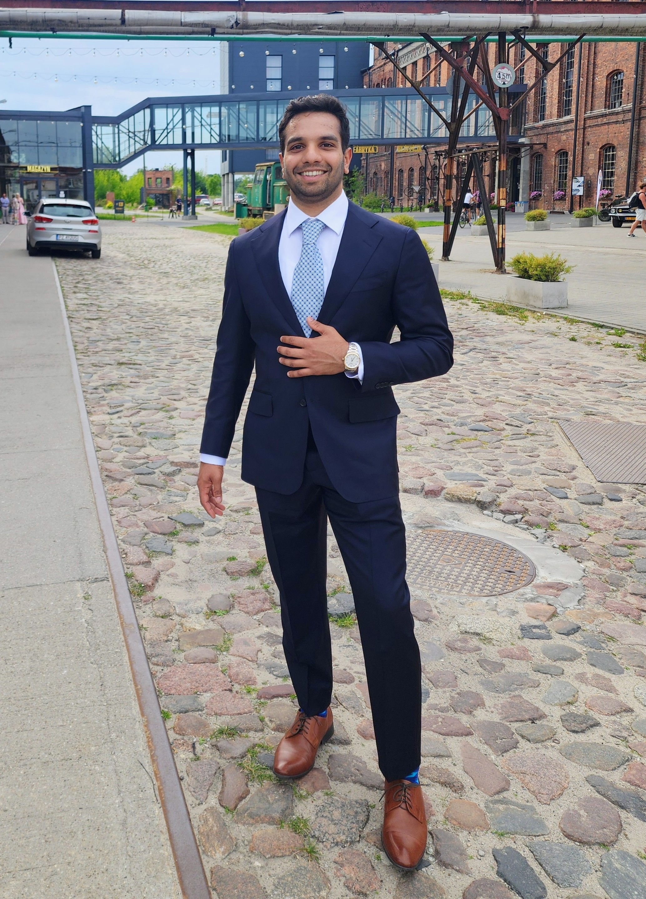

{width=220 fig-align="left"}

It's pretty fun to find similar ideas across unrelated fields. It's that "wait, I've seen this before" feeling. Many of the pieces here are about it.

Right now I'm on a noncompete, going deep on modern deep learning. Working notes are on the [Writing](writing.qmd) page.

Previously, I spent four years at TD Securities Automated Trading, formerly Headlands Tech Global Markets, working on systematic fixed income trading. Before that, I was an applied scientist at Amazon, working on ML and optimization for personalization, causal inference, and supply chain.

Gymnastics has been a lifelong thing. I still love tossing a tkatchev or two. Vegan since 2016.
